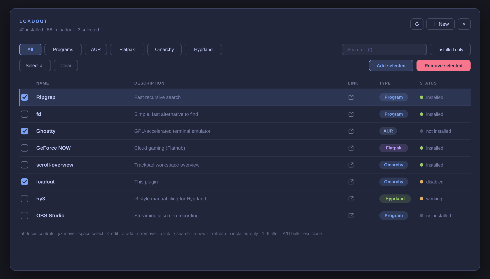

# Loadout

**One keyboard-driven table for everything you install on an Omarchy box — and a
one-press way to put it all back.**

Loadout is an Omarchy overlay that keeps a single list of the software you care
about across four package worlds — pacman & AUR programs, **Flatpak** apps,
**Omarchy** shell plugins, and **Hyprland** (hyprpm) plugins. Tick some rows,
press **Add selected** or **Remove selected**, and it runs the whole batch in one
themed terminal.



## What it's for

- **A loadout you own.** The table is a curated list of what you'd reinstall on a
  fresh machine, kept in your own JSON file. **Removing a row uninstalls the
  thing but keeps the row**, so re-adding it later is one keypress.
- **Bulk add / remove.** Select across types; Loadout builds a single shell
  command for the batch, hands it to a floating terminal (which shows a manifest
  of what's happening and handles the `sudo` prompt), and closes.
- **A live inventory.** On open and on **Refresh** it auto-imports what you
  already have, so the table doubles as a real picture of the machine — you don't
  re-enter your existing software by hand.
- **Keyboard-first.** Every action has a key; the hint row along the bottom is
  the whole cheat sheet. `Tab` also walks the controls for mouse-free pointing.

### What gets auto-imported

- every third-party Omarchy shell plugin and every hyprpm plugin
- every installed Flatpak app
- every explicitly-installed pacman/AUR package that ships a desktop launcher —
  i.e. the GUI apps (LibreOffice, the browser, mpv, OBS, …), found via
  `pacman -Ql` + a `NoDisplay`/`Hidden` check

The rest of `pacman -Qqe` (libraries, toolchains, the base system) is left out —
it's hundreds of entries and none of it is what "my loadout" means.

Known limitation: an auto-imported row you delete reappears on the next refresh
as long as the thing is still installed. To make it stick, remove the package
itself (from Loadout or the shell), or keep the row and ignore it.

## Opening it

Loadout is a one-off tool with no dedicated hotkey. It lives in the **Omarchy
menu** — run the installer once:

```sh
~/.config/omarchy/plugins/jgarza.loadout/extras/install.sh
```

That enables the plugin, adds a top-level **Loadout** row to the Omarchy menu
(`SUPER+SPACE`), and installs an app-launcher entry. After that:

- `SUPER+SPACE` → **Loadout**
- app launcher → **Loadout**
- `omarchy menu summon loadout`
- `omarchy-shell shell toggle jgarza.loadout '{}'`  ← bind this yourself if you
  really want a key

## How it works

### The catalog

Your loadout lives at `~/.config/omarchy/jgarza.loadout/catalog.json` — a plain
JSON array, separate from this plugin's git checkout so it survives updates. On
first run it's seeded from `catalog.default.json`; on later runs any *new*
default rows are appended without touching your edits.

One row:

```json
{
  "name": "Ripgrep",
  "description": "Fast recursive search",
  "type": "pacman",              // pacman | aur | flatpak | omarchy | hyprland
  "ref": "ripgrep",              // pacman/aur: package name(s), space separated
                                 // flatpak: Flatpak app id(s), space separated
                                 // omarchy/hyprland: git URL
  "id": "",                      // omarchy: plugin id (auto-filled after install)
                                 // hyprland: hyprpm *plugin* name (for enable + status)
  "link": "https://…"            // homepage; defaults to ref when ref is a URL
}
```

For a **hyprland** row, `ref` is the git URL and `id` is the *plugin* name shown
by `hyprpm list` (used for `hyprpm enable` and status). `hyprpm remove` uses the
repo name, which Loadout derives from the URL. **Flatpak** installs come from
Flathub (`flatpak install -y flathub <id>`).

### Status

`bin/loadout-status` reports the live picture (`pacman -Qqe` / `-Qqm`,
`flatpak list --app`, `omarchy plugin list --json`, `hyprpm list`). Loadout runs
it on open, after every job, and on **Refresh**. The dot in the Status column:

- green **installed** / **disabled** — present (disabled = an Omarchy/Hyprland
  plugin that's installed but not enabled)
- grey **not installed**
- amber **working** — a job is in flight

### Running jobs

Selecting rows and pressing **Add selected** / **Remove selected** builds a
single shell command for the whole batch, launches it in
`omarchy-launch-floating-terminal-with-presentation` — the themed floating
terminal that shows the log and handles the `sudo` / polkit prompt for pacman
and hyprpm — then closes the Loadout window and focuses that terminal. Both
print a manifest first: how many items are going and each one spelled out
(package / plugin target and type); **Remove selected** additionally stops at
the `sudo` password prompt before the uninstall. Per-row **Add** / **Remove**
buttons run one row the same way but leave the window open.

Because that terminal is fire-and-forget, Loadout then polls status for a bit and
clears each row's *working* state when its install state actually changes.

A removed row stays in the table with its status off — deleting a row entirely
is a separate action in the row editor (double-click a row, or **＋ New**).

### Keyboard

| | |
|---|---|
| `j` / `k` / `↑` `↓` | move the row cursor |
| `g` / `G` / `Home` `End` / `PgUp` `PgDn` | jump |
| `space` | select / deselect the cursor row |
| `⏎` | edit the cursor row |
| `a` / `d` (or `x`) | add / remove the cursor row |
| `A` / `D` | add / remove **selected** (bulk) |
| `o` | open the cursor row's link |
| `n` | new entry &nbsp;·&nbsp; `r` refresh &nbsp;·&nbsp; `i` installed-only &nbsp;·&nbsp; `c` clear selection |
| `1`–`6` | filter: All / Programs / AUR / Flatpak / Omarchy / Hyprland |
| `/` or `Ctrl+F` | search &nbsp;·&nbsp; `Ctrl+A` select all &nbsp;·&nbsp; `Esc` back out / close |
| `Tab` / `Shift+Tab` | move focus between the controls (header, filters, search, action bar, table) |

## Files

| File | |
|---|---|
| `Loadout.qml` | overlay lifecycle, state, jobs, persistence |
| `LoadoutTable.qml` | the table |
| `RowEditor.qml` | add / edit / delete one entry |
| `Catalog.js` | pure logic (normalize, merge, reconcile, command building) — `node tests/catalog.test.js` |
| `bin/loadout-status` | current-state probe (JSON) |
| `catalog.default.json` | starter loadout |
| `docs/` | the screenshot above (`loadout.svg` source + rendered `loadout.png`) |
| `extras/` | Omarchy-menu entry, `install.sh`, `.desktop` |

## Uninstalling

```sh
omarchy plugin remove jgarza.loadout --yes
rm ~/.local/share/applications/jgarza-loadout.desktop
```

and delete the `"loadout"` line from
`~/.config/omarchy/extensions/omarchy-menu.jsonc`. Your
`~/.config/omarchy/jgarza.loadout/` catalog is left alone — delete it if you want
it gone.

## License

MIT © jgarza
