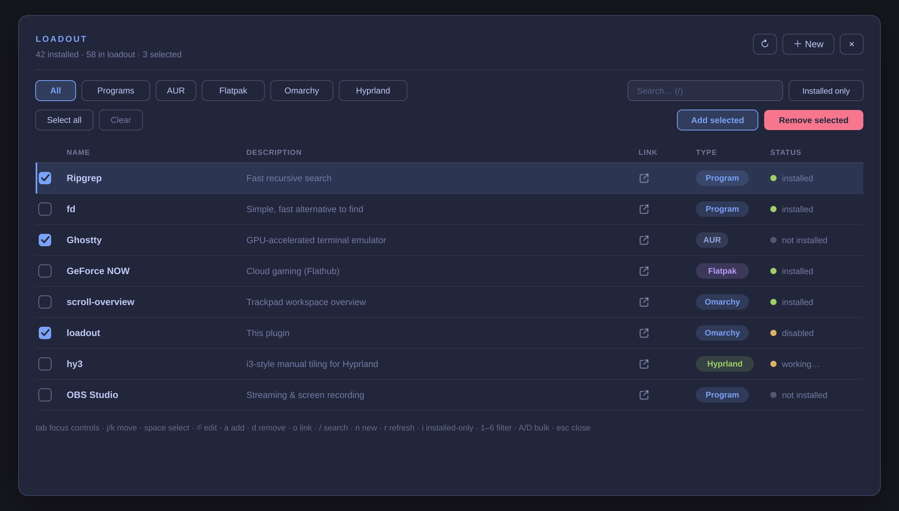

# Loadout

**One keyboard-driven table for everything you install on an Omarchy box — and a
one-press way to put it all back.**

Loadout is an Omarchy overlay that keeps a single list of the software you care
about across four package worlds — pacman & AUR programs, **Flatpak** apps,
**Omarchy** shell plugins, and **Hyprland** (hyprpm) plugins. Tick some rows,
press **Add selected** or **Remove selected**, and it runs the whole batch in one
themed terminal.



## What it's for

- **A loadout you own.** The table is a curated list of what you'd reinstall on a
  fresh machine, kept in your own JSON file. **Removing a row uninstalls the
  thing but keeps the row**, so re-adding it later is one keypress.
- **Bulk add / remove.** Select across types; Loadout builds a single shell
  command for the batch, hands it to a floating terminal (which shows a manifest
  of what's happening and handles the `sudo` prompt), and closes.
- **A live inventory.** On open and on **Refresh** it auto-imports what you
  already have, so the table doubles as a real picture of the machine — you don't
  re-enter your existing software by hand.
- **Keyboard-first.** Every action has a key; the hint row along the bottom is
  the whole cheat sheet. `Tab` also walks the controls for mouse-free pointing.

### What gets auto-imported

- every third-party Omarchy shell plugin (what the running shell reports, plus
  any `manifest.json` under `~/.config/omarchy/plugins/*/` it missed) and every
  hyprpm plugin
- every installed Flatpak app
- every explicitly-installed pacman/AUR package that ships a desktop launcher —
  i.e. the GUI apps (LibreOffice, the browser, mpv, OBS, …), found via
  `pacman -Ql` + a `NoDisplay`/`Hidden` check

The rest of `pacman -Qqe` (libraries, toolchains, the base system) is left out —
it's hundreds of entries and none of it is what "my loadout" means.

Known limitation: an auto-imported row you delete reappears on the next refresh
as long as the thing is still installed. To make it stick, remove the package
itself (from Loadout or the shell), or keep the row and ignore it.

## Opening it

Loadout is a one-off tool with no dedicated hotkey. It lives in the **Omarchy
menu** — run the installer once:

```sh
~/.config/omarchy/plugins/jgarza.loadout/extras/install.sh
```

That enables the plugin, adds a top-level **Loadout** row to the Omarchy menu
(`SUPER+SPACE`), and installs an app-launcher entry. After that:

- `SUPER+SPACE` → **Loadout**
- app launcher → **Loadout**
- `omarchy menu summon loadout`
- `omarchy-shell shell toggle jgarza.loadout '{}'`  ← bind this yourself if you
  really want a key

## How it works

### The catalog

Your loadout lives at `~/.config/omarchy/jgarza.loadout/catalog.json` — a plain
JSON array, separate from this plugin's git checkout so it survives updates. On
first run it's seeded from `catalog.default.json`; on later runs any *new*
default rows are appended without touching your edits.

The file is never opened directly by the shell. `bin/loadout-catalog` reads and
writes it through one `O_NOFOLLOW | O_NONBLOCK` descriptor and refuses anything
that isn't a regular file you own, is group/world writable, or is over 1 MiB
(the same checks apply to its directory, which is created `0700`). Writes are
atomic (temp file + `fsync` + rename) and keep the file's existing mode. If the
file is rejected, Loadout shows why and won't save for the rest of the session,
so a bad file is never overwritten or followed.

One row:

```json
{
  "name": "Ripgrep",
  "description": "Fast recursive search",
  "type": "pacman",              // pacman | aur | flatpak | omarchy | hyprland
  "ref": "ripgrep",              // pacman/aur: package name(s), space separated
                                 // flatpak: Flatpak app id(s), space separated
                                 // omarchy/hyprland: git URL
  "id": "",                      // omarchy: plugin id (auto-filled after install)
                                 // hyprland: hyprpm *plugin* name (for enable + status)
  "link": "https://…"            // homepage; defaults to ref when ref is a URL
}
```

For a **hyprland** row, `ref` is the git URL and `id` is the *plugin* name shown
by `hyprpm list` (used for `hyprpm enable` and status). `hyprpm remove` uses the
repo name, which Loadout derives from the URL. **Flatpak** installs come from
Flathub (`flatpak install -y -- flathub <id>`).

Every target is checked against its backend's format before it can reach a
command, so a value can never be read as an option (e.g. `--config=…`). The
row editor shows the problem inline and won't save; an invalid row already in
the catalog is skipped with a toast.

| Type | Accepted |
|---|---|
| pacman / aur | Arch package names: `a-z 0-9 @ . _ + -`, not starting with `-` or `.` |
| flatpak | reverse-DNS app ids with at least three parts, e.g. `org.gnome.Calculator` |
| omarchy / hyprland `ref` | `https://host/path` or `git@host:path` (no `http://`, `git://`, `file://`); an omarchy row cloned from a built-in may use its plugin id instead (remove only) |
| omarchy / hyprland `id` | `A-Z a-z 0-9 . _ -`, starting with a letter or digit |

Commands call every tool by absolute path (`/usr/share/omarchy/bin/…`,
`/usr/bin/flatpak`, `/usr/bin/hyprpm`), and links only open when they're
`https://`.

### Status

`bin/loadout-status` reports the live picture (`pacman -Qqe` / `-Qqm`,
`flatpak list --app`, `omarchy plugin list --json`, `hyprpm list`). Loadout runs
it on open, after every job, and on **Refresh**. It runs with a cleared
environment, a pinned `PATH`, and absolute tool paths, under a 20 s deadline
that kills the whole process group, with its output capped at 4 MiB. The dot in the Status column:

- green **installed**
- grey **not installed**
- amber **working** — a job is in flight

Installed Omarchy and Hyprland plugin rows also get an on/off switch in the
**Enabled** column. Click it or press `t` to flip it. Omarchy plugins switch
without a terminal (no root); a Hyprland plugin opens the terminal, since hyprpm
needs `sudo`. Either way Loadout comes back on the same row, search and filter
with the result as a toast. (Enabling or disabling an Omarchy plugin makes the
shell rebuild every panel, so `bin/loadout-toggle` runs the change detached and
reopens Loadout afterwards.)

Loadout opens on section 1, the search field.

### Running jobs

Selecting rows and pressing **Add selected** / **Remove selected** builds a
single shell command for the whole batch, launches it in
`omarchy-launch-floating-terminal-with-presentation` — the themed floating
terminal that shows the log and handles the `sudo` / polkit prompt for pacman
and hyprpm — then closes the Loadout window and focuses that terminal. Both
print a manifest first: how many items are going and each one spelled out
(package / plugin target and type); **Remove selected** additionally stops at
the `sudo` password prompt before the uninstall. Per-row **Add** / **Remove**
buttons run one row the same way but leave the window open.

Because that terminal is fire-and-forget, Loadout then polls status for a bit and
clears each row's *working* state when its install state actually changes.

A removed row stays in the table with its status off — deleting a row entirely
is a separate action in the row editor (double-click a row, or **＋ New**).

### AUR mode

AUR access is a **system-wide** setting with three states, managed by
`bin/omarchy-aur`. The **AUR:** button in section 5 (or `m`) opens its picker
in the floating terminal; it needs `sudo`. Loadout reads the current state back
on every refresh, so running the script by hand shows up too.

| Mode | System-wide | In Loadout |
|---|---|---|
| **on** (`enabled`) | yay/paru `mode=any`, AUR reachable | add · update · remove |
| **updates only** (`updates`) | as *on*, plus a pacman hook that aborts any *new* install of a package no sync repo provides | update · remove |
| **off** (`disabled`) | yay/paru `mode=repo`, `aur.archlinux.org` blackholed in `/etc/hosts` | nothing — AUR rows and the AUR filter tab are hidden |

In *updates only*, upgrades of AUR packages you already have — including
`omarchy update` — run as normal; `yay -S`, `paru -S` or `pacman -U` of
something new stops at the hook. An AUR update that pulls in a brand-new AUR
dependency is blocked too. The hook is
`/etc/pacman.d/hooks/00-omarchy-aur-updates-only.hook`, running the root-owned
`/usr/local/lib/omarchy-aur/guard`; switching to *on* or *off* removes both.

```sh
bin/omarchy-aur --enable | --updates-only | --disable   # [--all-users] [--yes]
bin/omarchy-aur --choose     # interactive picker (what the button runs)
bin/omarchy-aur --status     # human-readable
bin/omarchy-aur --mode       # enabled | updates | disabled
```

**Update AUR** (`u` for the cursor row, `U` for the selection) runs
`yay -S --aur --needed --noconfirm <pkgs>` on the installed AUR rows only;
`--needed` skips anything already current. Rows the mode forbids are left out
of a bulk job with a note in the toast.

### Keyboard

Everything works without a mouse. Press `?` in the panel for this list.

The panel is five numbered **sections**, each in its own box with its number
on the border; the one you're in is drawn in the accent colour.

| # | Section |
|---|---|
| 1 | search |
| 2 | type filters + *Installed only* |
| 3 | the list (where the panel opens) |
| 4 | act on the marked rows — select all, clear, add, update, remove |
| 5 | loadout — new row, refresh, AUR mode |

They're numbered in the order you work: narrow the list, mark rows, act on
them. The **esc** button (top right) closes it for the mouse and sits outside the sections; `Esc` / `q` close from anywhere.

| | |
|---|---|
| `Tab` / `Shift+Tab` | next / previous section (each remembers where you were) |
| `1`–`5` | jump to a section (in the search field: only while it's empty — once there's text, digits are part of the search) |
| `←` `↓` `↑` `→` / `h` `j` `k` `l` | move within the section — in the list, `↑↓` `jk` move rows and `←→` `hl` switch the type filter |
| `⏎` / `space` | press the focused button · in the list, mark / unmark the row |
| `Esc` | close Loadout, from anywhere (search, help sheet, row editor included) |
| `g` / `G` / `Home` `End` | first / last row |
| `Ctrl+D` / `Ctrl+U` · `PgDn` / `PgUp` | half page · ten rows |
| `J` / `K` / `Shift+↑` `↓` | extend the marking while moving |
| `Ctrl+A` · `c` | mark all shown · clear marks |
| `a` / `d` (or `x`) / `u` | add / remove / update-AUR the cursor row |
| `A` / `D` / `U` | add / remove / update-AUR the **marked** rows |
| `t` | enable / disable the cursor plugin (Omarchy or Hyprland) |
| `e` (or double-click) · `n` | edit the cursor row · new row |
| `Delete` twice | drop the cursor row from the loadout (doesn't uninstall) |
| `m` | set AUR mode system-wide (opens a terminal) |
| `i` | installed only |
| `/` or `Ctrl+F` | search (section 1); `⏎` or `↓` jumps into the results |
| `o` · `r` / `Ctrl+R` | open the row's link · refresh status |
| `q` · `?` | close · shortcut sheet |

In the row editor:

| | |
|---|---|
| `Tab` / `Shift+Tab` / `↑` `↓` | move between every field and button |
| `Ctrl+1`–`5` · `←` `→` on a type | pick the type |
| `⏎` in a field · `Ctrl+S` | save |
| `Ctrl+Delete` twice | delete the entry |
| `Esc` | close Loadout (unsaved edits are dropped) |

## Files

| File | |
|---|---|
| `Loadout.qml` | overlay lifecycle, state, jobs, persistence |
| `LoadoutTable.qml` | the table |
| `RowEditor.qml` | add / edit / delete one entry |
| `Catalog.js` | pure logic (normalize, merge, reconcile, command building) — `node tests/catalog.test.js` |
| `bin/loadout-status` | current-state probe (JSON) |
| `bin/loadout-catalog` | bounded, no-follow, atomic catalog read/write — `bash tests/persist.test.sh` |
| `catalog.default.json` | starter loadout |
| `docs/` | the screenshot above (`loadout.svg` source + rendered `loadout.png`) |
| `extras/` | Omarchy-menu entry, `install.sh`, `.desktop` |

## Uninstalling

```sh
omarchy plugin remove jgarza.loadout --yes
rm ~/.local/share/applications/jgarza-loadout.desktop
```

and delete the `"loadout"` line from
`~/.config/omarchy/extensions/omarchy-menu.jsonc`. Your
`~/.config/omarchy/jgarza.loadout/` catalog is left alone — delete it if you want
it gone.

## License

MIT © jgarza
